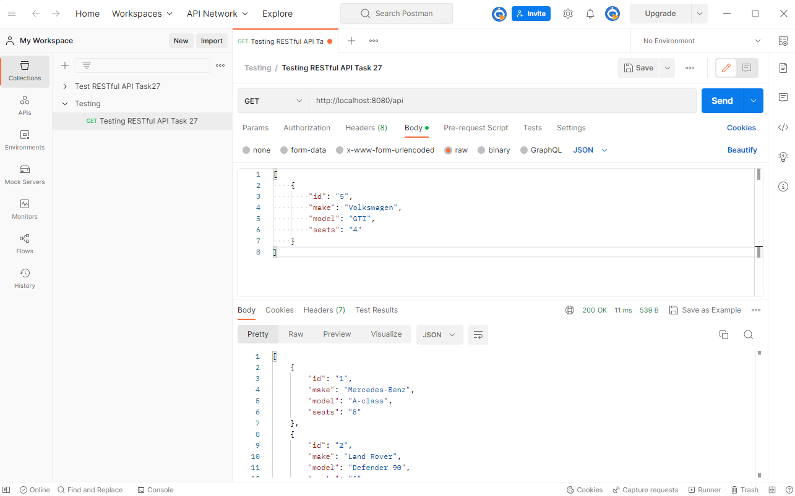
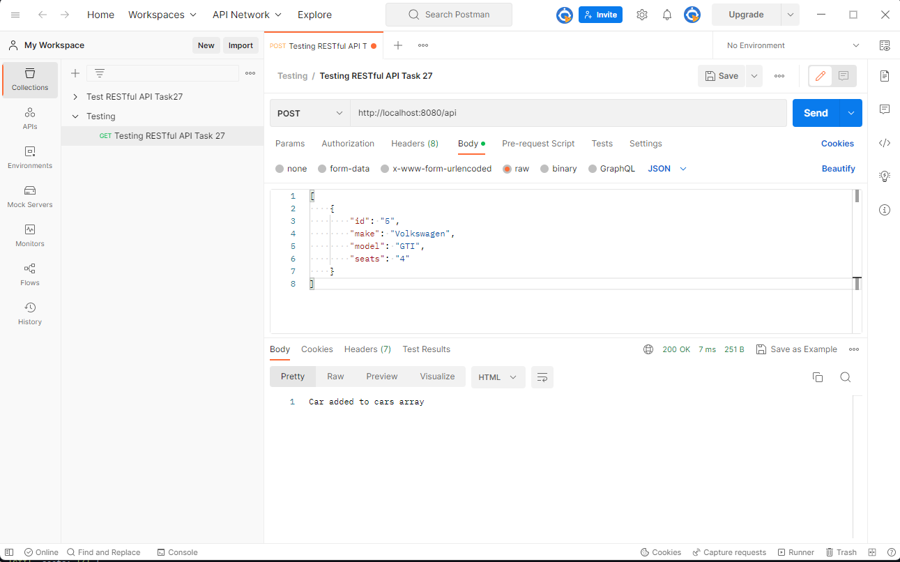
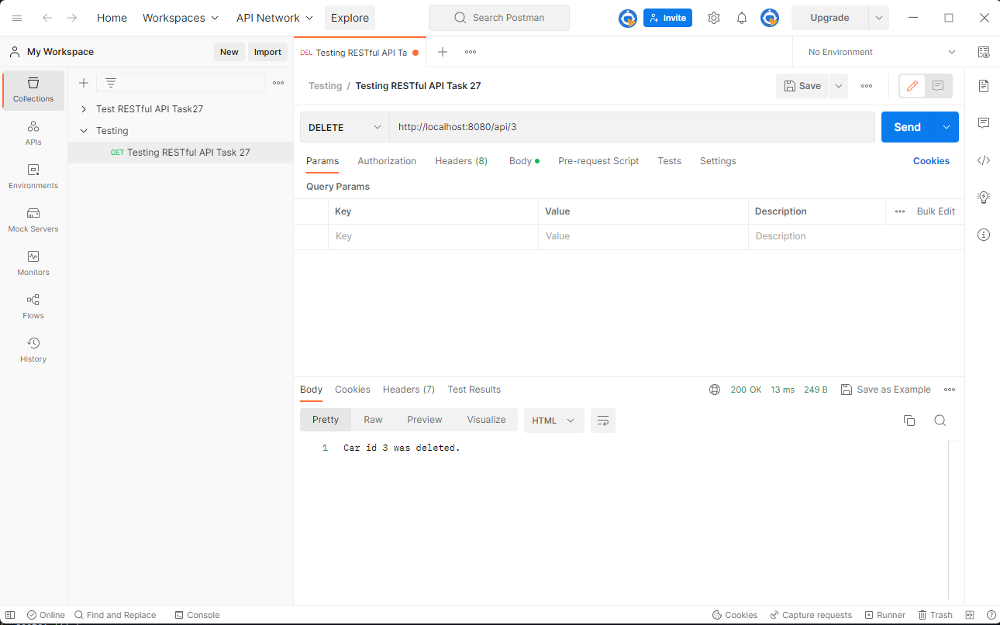
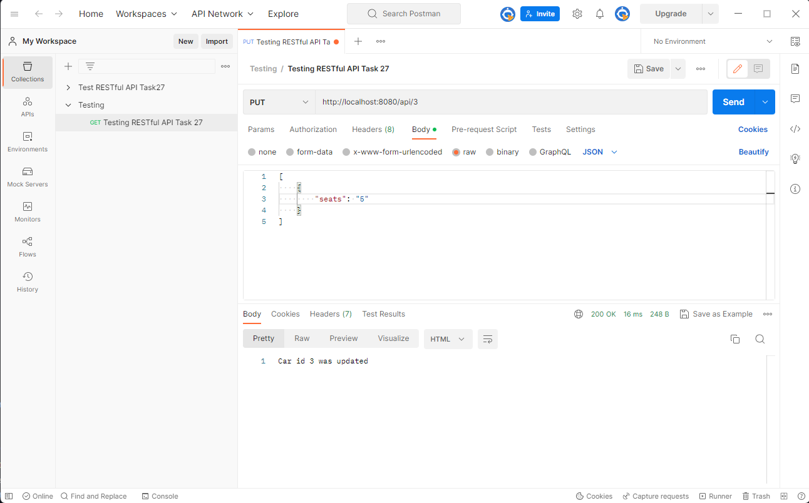

# RESTful car_api v1.0.0

## Index
1. Introduction and About
2. Installation
3. Usage
4. Credits and Versioning

## 1. Introduction and About

This is a very basic RESTful API to serve as an introduction to this form of API. The purpose of it is purely for learning the skill of setting up this type of API.

## 2. Installation

There are very minimal intallation requirements, but there are some dependencies that need to be installed by entering the following command:  

`yarn install`

## 3. Usage

Once the dependencies have been installed the API should be started by entering the following command:  

`yarn start`

From there it is off to the Postman application to experiment a little bit with the API. The Postman Application can be found at:  

[Postman Application](https://www.postman.com/)

It is assumed that the user is competent in the use of the Postman Application.

The API is capable of receiving requests to:  
1. Get a list of cars back from the API
2. Add a car to the list
3. Delete a car using its id
4. Update the model or number of seats

### 1. GET request to get a list of cars back from the API

Simply add the API address into the Postman application and set the GET request up as in the image below:  

### 2. POST request to add a car to the list

Change the setting to POST and go to the body section, select raw JSON data and enter the details of the new car in JSON format.

### 3. DELETE request to remove a car from the list

Change the setting to DELETE and end the URL with / followed by the id of the car that needs to be deleted. See an example in the image below:  

### 4. PUT request to update a car's model or number of seats

This method updates any of the properties of any given car, identified by its id. It is done by adding / and the id number to the base url and then adding the property that needs to be amended in the body of the request. Refer to the image below for a clearler description of what must be done on Postman.

